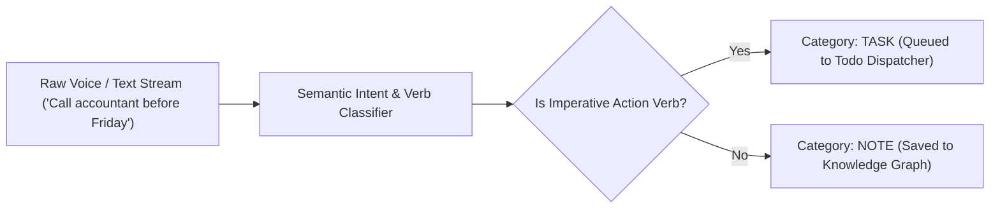

# genpark-ambient-voice-thought-stream-capture-skill

> Ambient Voice & Thought Stream Capture. 100% Python Standard Library.

Distilled from **Catch**, transforming unstructured stream-of-consciousness voice notes and texting scratchpads into categorized actionable tasks and reflective notes.

## Architecture

## Features
- **Zero Friction Input**: Accepts any fleeting thought without demanding structured fields.
- **Fast Action Item Extraction**: Automatically tags tasks vs reflective thoughts.
